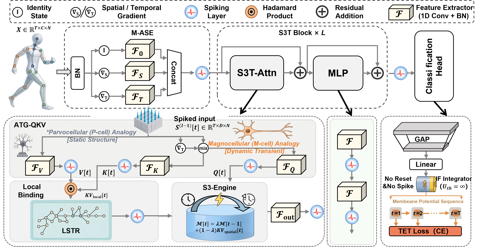

# S3T-Former: A Purely Spike-Driven State-Space Topology Transformer for Skeleton Action Recognition

**Official implementation** of:

> **S3T-Former: A Purely Spike-Driven State-Space Topology Transformer for Skeleton Action Recognition**  
> [**arXiv:2603.18062**](https://arxiv.org/abs/2603.18062)

**Authors:** Naichuan Zheng, Hailun Xia, Zepeng Sun, Weiyi Li, Yujia Wang

**Abstract (short):** S3T-Former targets skeleton-based action recognition with a **purely spike-driven** design: native LIF neurons, **state-space** structure for long-range temporal modeling, and **topology-aware** attention that propagates information along the skeleton graph. This codebase supports NTU RGB+D 60/120 and NW-UCLA with multi-stream (joint / bone / motion) configs.

<p align="center">
  
</p>

---

## Table of Contents

- [Installation](#installation)
- [Project Structure](#project-structure)
- [Usage](#usage)
- [Model Configuration](#model-configuration)
- [Output Files](#output-files)
- [Quick Test](#quick-test)
- [Core Features](#core-features)
- [Citation](#citation)

---

## Installation

```bash
pip install -r requirements.txt
```

## Project Structure

```
spiking-topo-transformer-code/
├── model/
│   ├── __init__.py
│   └── spiking_ssm_topo_transformer.py
├── feeders/
│   ├── __init__.py
│   ├── feeder_ntus.py      # NTU RGB+D 60/120 (.npz, 25 joints, 2 persons)
│   ├── feeder_ucla.py      # NW-UCLA (.json, 20 joints, 1 person)
│   ├── bone_pairs.py       # NTU / UCLA bone topology pairs
│   └── tools.py
├── graph/
│   ├── __init__.py
│   ├── ntu_rgb_d.py        # 25-joint graph
│   ├── ucla.py             # 20-joint graph (NW-UCLA)
│   └── tools.py
├── config/
│   ├── nturgbd-cross-subject-s3t-former-*.yaml   # NTU60 CS: joint / bone / joint-motion / bone-motion
│   ├── nturgbd-cross-view-s3t-former-*.yaml       # NTU60 CV: same four streams
│   ├── ntu120-cross-subject-s3t-former-*.yaml     # NTU120 CSub
│   ├── ntu120-cross-set-s3t-former-*.yaml       # NTU120 CSet
│   └── nw-ucla-s3t-former-*.yaml                 # NW-UCLA four streams
├── S3-former.png         # Method figure (see paper)
├── train.py
├── test_model.py
├── requirements.txt
└── README.md
```

## Usage

### 1. Prepare Data

**NTU RGB+D 60 / 120** — `.npz` with `x_train`, `y_train`, `x_test`, `y_test` (same layout as common 2s-AGCN / CTR-GCN feeders).

| Setting | Example `.npz` |
|--------|----------------|
| NTU60 Cross-Subject | `NTU60_CS.npz` |
| NTU60 Cross-View | `NTU60_CV.npz` |
| NTU120 Cross-Subject | `NTU120_CSub.npz` |
| NTU120 Cross-Set | `NTU120_CSet.npz` |

**NW-UCLA** — under `data_path`, use subfolders `train/` and `val/`, each containing one JSON per sequence: `{"skeletons": ...}` with shape `(T, 20, 3)`. Class id is read from the filename prefix `aXX_...` → class `XX-1` (10 classes). Alternatively set `label_path` to a JSON list of `{"file_name": "stem_without_.json", "label": 1}` (label 1-based).

### 2. Modify Configuration File

Edit the YAML for your benchmark and stream:

- **NTU60 CS**: `config/nturgbd-cross-subject-s3t-former-{joint,bone,joint-motion,bone-motion}.yaml`
- **NTU60 CV**: `config/nturgbd-cross-view-s3t-former-*.yaml`
- **NTU120 CSub / CSet**: `config/ntu120-cross-subject-s3t-former-*.yaml`, `config/ntu120-cross-set-s3t-former-*.yaml`
- **NW-UCLA**: `config/nw-ucla-s3t-former-*.yaml` (`num_nodes: 20`, `num_person: 1`)

Set `train_feeder_args.data_path` / `test_feeder_args.data_path` to your `.npz` or NW-UCLA root directory.

### 3. Train Model

```bash
python train.py \
  --config config/nturgbd-cross-subject-s3t-former-joint.yaml \
  --work-dir ./logs/s3t-former-ntu60-cs-joint \
  --seed 1
```

### 4. Arguments

| Argument | Description |
|----------|-------------|
| `--config` | Configuration file path |
| `--work-dir` | Directory for checkpoints and saved config |
| `--seed` | Random seed |

## Model Configuration

Main knobs in `model_args` inside each YAML:

- `embed_dim`: Embedding dimension (default: 384)
- `depth`: Number of Transformer blocks (default: 6)
- `num_heads`: Attention heads (default: 8)
- `num_classes`: 60 (NTU-60), 120 (NTU-120), 10 (NW-UCLA)
- `num_nodes` / `num_person`: 25 / 2 for NTU; 20 / 1 for NW-UCLA
- `v_threshold`: LIF threshold (default: 0.5)
- `use_topology_bias`: Topology-aware routing (default: true)
- `use_temporal_gradient_qkv`: ATG-QKV (default: true)

## Output Files

In `work_dir` after training:

- `config.yaml` — copy of the training configuration
- `best_model.pth` — best validation checkpoint
- `latest_model.pth` — latest checkpoint (includes optimizer state when saved)

## Quick Test

```bash
python test_model.py
```

## Core Features

1. **Pure LIF design** — No ad-hoc modifications inside neuron dynamics; spiking remains the native compute primitive.
2. **State-space attention** — Long-term temporal context via structured decay states, not by patching membrane equations.
3. **Topology-aware routing** — Skeleton graph guides spatial spike / feature propagation (LSTR-style inductive bias).
4. **Multi-stream configs** — Joint, bone, and motion (and bone-motion) streams via feeder flags + matching YAMLs.

---

## Citation

If you use this code or the method in your research, please cite the **arXiv** paper (and prefer this BibTeX when referring to S3T-Former):

```bibtex
@article{zheng2026s3tformer,
  title={S3T-Former: A Purely Spike-Driven State-Space Topology Transformer for Skeleton Action Recognition},
  author={Zheng, Naichuan and Xia, Hailun and Sun, Zepeng and Li, Weiyi and Wang, Yujia},
  journal={arXiv preprint arXiv:2603.18062},
  year={2026}
}
```

**Paper:** [https://arxiv.org/abs/2603.18062](https://arxiv.org/abs/2603.18062)
